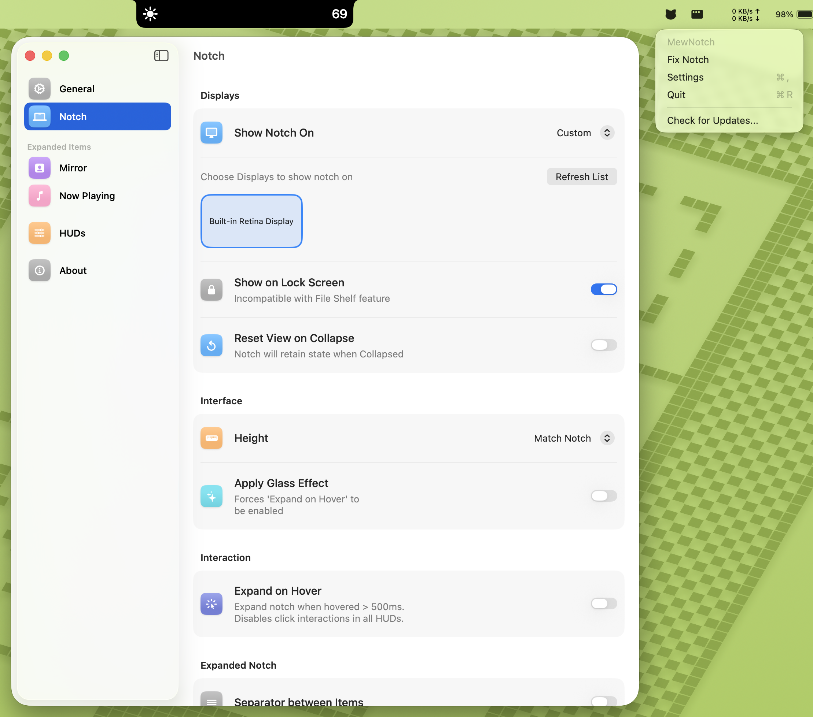

<div>
<h3 style="font-size: 2.5rem; letter-spacing: 1px;">MewNotch</h3>
<p style="font-size: 1.15rem; font-weight: 500;">
    <strong>Make the Mac Notch Actually Useful!</strong><br>
    MewNotch is a free, open-source macOS app that transforms the notch into a customizable HUD for brightness, volume, power, and more. Minimal, beautiful, and privacy-friendly.
  </p>

<br/><br/>

<div align="center">

[](LICENSE)
  [](https://github.com/monuk7735/mew-notch/releases)
  [](https://github.com/monuk7735/mew-notch/issues)
  [](https://github.com/monuk7735/mew-notch/pulls)
  [](https://www.apple.com/macos/)
  <!-- [](https://www.reddit.com/r/MewNotch/) -->

<br/>

<a href="https://github.com/monuk7735/mew-notch/releases"></a>

<br/>

<br/>

</div>

<hr>

## Features

- **Brightness Display** - Displays brightness adjustments in real-time, including optional auto-brightness changes.
- **Sound Level Display** - Shows input/output volume changes directly on the notch.
- **System HUD Suppression** - Option to completely hide the stock macOS HUDs for a cleaner experience.
- **File Shelf** - Drag and drop files to the notch for quick access. **Now with Persistence!** Files stay there even after restarts.
- **Power State** - Show current power source. **New:** Toggle "Time Remaining" display for a cleaner look.
- **Notch on Lock Screen** - The notch HUD is now visible even on the macOS lock screen.
- **Now Playing** - Control now playing media directly from notch. Expand notch for additional controls.
- **Mirror** - Get a quick peek on how you're looking by using the mirror in expanded notch. Now with customizable corner radius.
- **Auto Updates** - Built-in updater (Sparkle) to keep your app always up to date.
- **Modern Settings UI** - Completely redesigned settings experience for easier customization.
- **Fully Custom Notch Experience** - Choose the displays you want to see the notch on.
- **SwiftUI-based UI** - Smooth animations and modern macOS styling.

## Installation

### Homebrew

```bash
brew install --cask monuk7735/tap/mew-notch --no-quarantine
```

### Manual Download

1. Download the latest release from [GitHub Releases](https://github.com/monuk7735/mew-notch/releases).
2. Move the app to the Applications folder.
3. Run the app and grant necessary permissions if prompted.


### ⚠️ "Damaged" or "Unidentified Developer" Error?

> I don't have an Apple Developer account yet, so the application will display a popup on the first launch.

**Option 1 (Recommended): Allow via System Settings**

1. Open **System Settings** → **Privacy & Security**.
2. Scroll down to the **Security** section.
3. Look for "**MewNotch** was blocked..." and click **Open Anyway**.
4. Click **Open** in the confirmation popup.

**Option 2 (Advanced): Run this command in Terminal**

```bash
xattr -cr /Applications/MewNotch.app
```

This command simply removes the "quarantine" flag that macOS places on apps downloaded from the internet, resolving the false error.

- `xattr` : The utility to modify file attributes.
- `-c` : Clears all attributes (removes the "quarantine" flag).
- `-r` : Recursive (applies to all files inside the app bundle).

## Usage


1. Launch **MewNotch**.
2. Re-launch to open settings, if required. Notch won't appear at first launch on non-notched devices.
3. Adjust the volume or brightness using Keyboard or Touch Bar.
4. Customise the settings to have notch on different or all monitors.
5. Enjoy the sleek visual feedback right on the notch!

## Roadmap

- [x] ~~Add support for different types of HUD UIs.~~
- [x] ~~Allow users to toggle usage of each HUD variant.~~
- [x] ~~Icon in Menu bar to show app's running status.~~
- [x] ~~Add Touch bar support.~~
- [x] ~~Now playing music HUD.~~
- [x] ~~Actions on Now Playing HUD. Hover to see magic.~~
- [x] ~~Now Playing Detail on Expanded Notch View.~~
- [x] ~~Expand notch on hover.~~
- [x] ~~Mirror View~~
- [x] ~~Complete Control over which monitor shows the notch~~
- [x] ~~Explore different options for Now Playing media support on macOS 15.4 and above.~~
- [x] ~~Shelf for files in expanded notch view~~
- [x] ~~Persist Shelf Files across restarts~~
- [ ] Making shelf work with **Show on Lockscreen** enabled (Currently mutually exclusive for security).
- [ ] HUD for displaying keyboard backlight changes.
- [ ] Explore additional notch-based utilities.

## Dependency
- [Lottie](https://github.com/airbnb/lottie-ios)
- [LaunchAtLogin-Modern](https://github.com/sindresorhus/LaunchAtLogin-Modern)
- [SwiftyJSON](https://github.com/SwiftyJSON/SwiftyJSON)
- [Sparkle](https://github.com/sparkle-project/Sparkle)
- [MacroVisionKit](https://github.com/TheBoredTeam/MacroVisionKit)

## Contributing

Contributions are welcome! Feel free to open issues or submit pull requests.

## License

This project is licensed under the [GPLv3 License](LICENSE).

## Acknowledgments

- Inspired by the idea of making the Mac notch actually useful!
- Built with ♥️ using Swift and SwiftUI.
- Some parts built with 😭 using Objective-C for system integration.
- Special thanks to the following GitHub repositories for their code and inspiration:
  - [mediaremote-adapter](https://github.com/ungive/mediaremote-adapter)
  - [SlimHUD](https://github.com/AlexPerathoner/SlimHUD)
  - [SkyLightWindow](https://github.com/Lakr233/SkyLightWindow)
  - [EnergyBar](https://github.com/billziss-gh/EnergyBar)
  - [boring.notch](https://github.com/TheBoredTeam/boring.notch)
